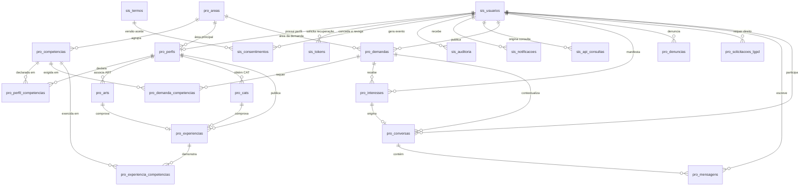

# CREA Pro-Link — Modelo Entidade-Relacionamento

Versão textual do modelo, para leitura e controle de versão. Os arquivos
`mer.svg`, `mer.png` e `mer.pdf` neste mesmo diretório trazem o diagrama
completo, com todos os atributos e tipos.

Todos os três são **gerados a partir do banco criado por
`_arq/estrutura.sql`**, de modo que não podem divergir do schema.

## Sobre o formato `.mwb`

O item 8.3.2.b admite o MER em **PDF, PNG e/ou arquivo editável `.mwb`**. A
entrega usa as três primeiras formas: PDF e PNG para leitura, e SVG como
formato vetorial editável, aberto e versionável — legível em qualquer navegador
ou editor gráfico, o que o `.mwb` (binário e específico do MySQL Workbench)
não é. O script gerador está preservado na documentação de arquitetura, de modo
que o diagrama pode ser regerado a qualquer momento a partir do banco.

## Diagrama

## Entidades e cardinalidades

### Módulo `sis_` — sistema, segurança e proteção de dados

| Entidade | Relacionamentos |
|---|---|
| `sis_usuarios` | 1:0..1 com `pro_perfis`; 1:N com tokens, consentimentos, auditoria, notificações, consultas à API, demandas, interesses, denúncias, requisições LGPD, conversas e mensagens |
| `sis_tokens` | N:1 com `sis_usuarios`; exclusão em cascata |
| `sis_termos` | 1:N com `sis_consentimentos`; ao remover a versão, o consentimento é preservado com referência nula |
| `sis_consentimentos` | N:1 com usuário e com versão do termo; tabela somente de inserção |
| `sis_auditoria` | N:1 com usuário, opcional para permitir evento anônimo; ao excluir o usuário, o evento permanece sem identificação |
| `sis_configuracoes` | independente; unicidade em grupo e chave |
| `sis_notificacoes` | N:1 com usuário |
| `sis_api_consultas` | N:1 com usuário, opcional |

### Módulo `pro_` — Pro-Link

| Entidade | Relacionamentos |
|---|---|
| `pro_areas` | 1:N com competências, perfis e demandas |
| `pro_competencias` | N:1 com área; 1:N com os três vínculos de competência |
| `pro_perfis` | 1:1 com usuário; 1:N com competências, ARTs, CATs e experiências |
| `pro_perfil_competencias` | associativa perfil × competência, com nível; unicidade no par |
| `pro_arts` | N:1 com perfil; unicidade em perfil e número da ART |
| `pro_cats` | N:1 com perfil; unicidade em perfil e número da CAT |
| `pro_experiencias` | N:1 com perfil; 0..1 com ART e 0..1 com CAT |
| `pro_experiencia_competencias` | associativa experiência × competência |
| `pro_demandas` | N:1 com autor e com área; 1:N com requisitos e interesses |
| `pro_demanda_competencias` | associativa demanda × competência, com peso e obrigatoriedade |
| `pro_interesses` | N:1 com demanda e com usuário; unicidade no par, impedindo manifestação duplicada |
| `pro_conversas` | N:1 com dois usuários, opcionalmente com demanda e interesse |
| `pro_mensagens` | N:1 com conversa e com autor |
| `pro_denuncias` | N:1 com denunciante e com analista, ambos opcionais; alvo referenciado por entidade e identificador |
| `pro_solicitacoes_lgpd` | N:1 com titular e com analista |

## Convenções aplicadas

Conforme o item 8.6 do Termo de Referência:

- tabelas prefixadas pelo módulo: `sis_` (sistema) e `pro_` (Pro-Link);
- campos prefixados por três letras da tabela: `usu_`, `prf_`, `dem_`, `art_`;
- chave primária `<prefixo>_id`;
- restrições nomeadas: `pk_`, `fk_`, `uk_` (unicidade) e `idx_` (índice);
- campos de controle em todas as tabelas: `xxx_dt_registro`, `xxx_log` e
  `xxx_status`;
- `xxx_status` do tipo `CHAR(1)`, com `'A'` como valor padrão;
- exclusão lógica pelo valor `'X'`, com restauração pela lixeira administrativa;
- `utf8mb4` e `utf8mb4_unicode_ci` em todo o banco;
- InnoDB em todas as tabelas, com integridade referencial declarada.

## Índices

Além das chaves primárias e das restrições de unicidade:

- busca de usuário por CPF, CNPJ, RNP, perfil e situação;
- busca de perfil por localização, visibilidade e disponibilidade;
- busca de demanda por situação, localização, autor e prazo, mais índice
  *fulltext* em título e escopo;
- consulta de auditoria por usuário, ação, entidade e data;
- fila de notificações por situação, canal e data;
- consultas à API por recurso, resultado e data.
